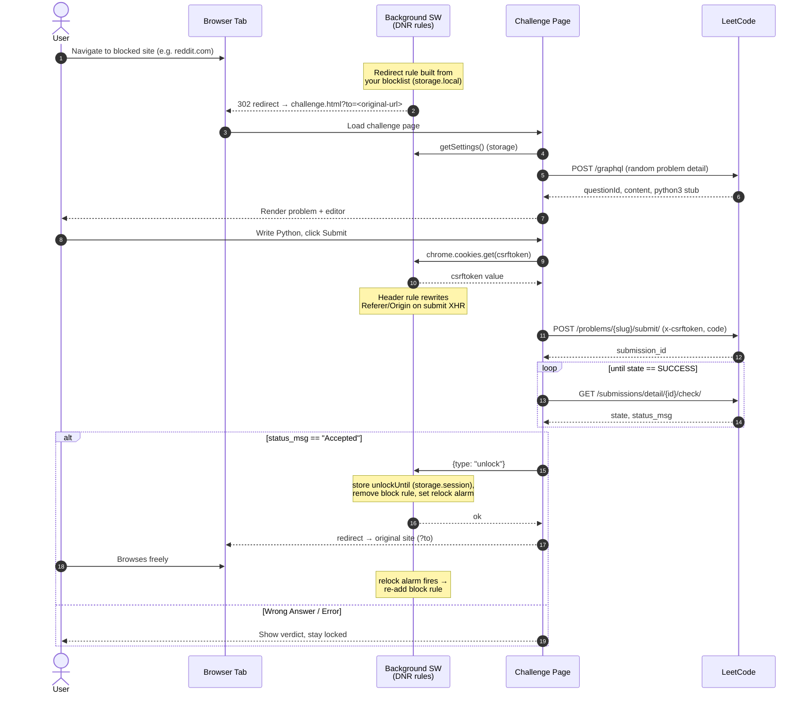

# Distraction LeetCode Gate

A Chrome (Manifest V3) extension that blocks the sites *you* choose until you
solve a real LeetCode problem in Python. On an `Accepted` verdict, your blocked
sites unlock for a configurable window (default 20 min), then auto-relock.

## How it works

- A `declarativeNetRequest` session rule redirects any blocked domain to a
  bundled challenge page. The rule's pattern is built dynamically from your
  blocklist in `chrome.storage.local`.
- The challenge page fetches a random (non-premium) problem from LeetCode's
  GraphQL API and pre-fills the `python3` stub.
- It submits your code to LeetCode's **real judge** using your existing
  `leetcode.com` login cookies. A DNR rule fixes up `Referer`/`Origin` so the
  submission is accepted.
- On `Accepted`, the background worker drops the gate rule and sets a relock alarm.

## Flow

## Install (unpacked)

1. Open `chrome://extensions` → enable **Developer mode**.
2. **Load unpacked** → select this folder.
3. **Log in to LeetCode** at https://leetcode.com in the same browser profile.
4. Visit a blocked site → you'll be sent to the challenge page.

## Customizing the blocklist

Click the extension icon → **Edit blocked sites**, or right-click the icon →
**Options**. There you can:

- **Add any sites** — one per line. Paste a full URL; it's trimmed to the bare
  domain (e.g. `https://www.x.com/home` → `x.com`). Subdomains are matched too.
- **Set the unlock window** in minutes.

Defaults: `reddit.com`, `instagram.com`, `x.com`, 20 minutes. Changes apply
immediately.

## Notes

- **Problem pool:** edit `PROBLEM_SLUGS` in `problems.js`.
- **Unlock state is per-browser-session** (`chrome.storage.session`), so closing
  Chrome relocks you. The blocklist itself persists (`chrome.storage.local`).
- **Solving once unlocks all blocked sites** for the window (global unlock).
- **Broad host permission:** the manifest requests `<all_urls>` so you can block
  *any* domain without editing files. It's used only to redirect blocked sites
  and to talk to LeetCode.
- **Friction, not security:** you can disable the extension. By design.

## Possible upgrades

- Per-site unlock (each site costs its own problem).
- CodeMirror/Monaco editor with Python highlighting.
- Difficulty escalation by unlock count; solve-streak stats in the popup.
